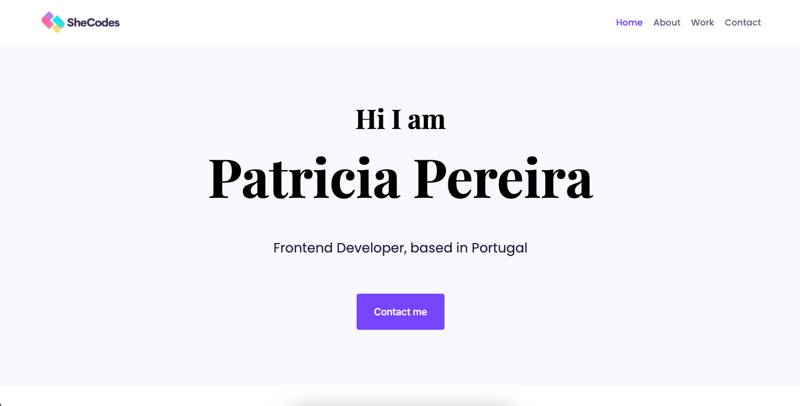
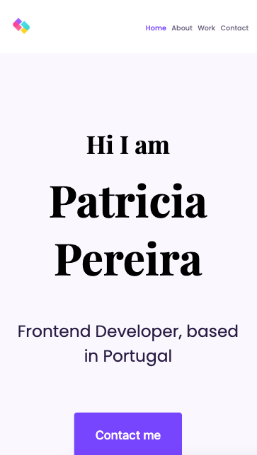

# SheCodes - The weather app solution

This is a solution to the [SheCodes Responsive Web Development](https://www.shecodes.io/workshop-pro). SheCodes teach women how to code in order to work towards decreasing the gender gap in the tech industry. Created with step-by-step tutorial.

## Table of contents

- [Overview](#overview)
  - [The challenge](#the-challenge)
  - [Screenshot](#screenshot)
  - [Links](#links)
- [My process](#my-process)
  - [Built with](#built-with)
  - [What I learned](#what-i-learned)
  - [Continued development](#continued-development)
  - [Useful resources](#useful-resources)
- [Author](#author)
- [Acknowledgments](#acknowledgments)

## Overview

### The challenge

Users should be able to:

- Use a multi-page website
- Responsive Design. Users can see an optimized website for mobile and computer devices.

### Screenshot

### Links

- Live Site URL: https://responsiveportfolio-patricia.netlify.app/

## My process

### Built with

- Semantic HTML5 markup
- CSS custom properties
- Flexbox
- CSS Grid

### What I learned

- Advanced JavaScript techniques (ES6) to build interactive application
- How to make code responsive to any screen size
- How to build a unique online portfolio
- How to host code on GitHub, advanced Bootstrap (Navigation, Utility Classes, etc.), Flexbox and more

## Author

- SheCodes - [Susanna Brechko](https://www.shecodes.io/graduates/78767-susanna-brechko)
- X - [@suereact](https://www.x.com/suereact)
